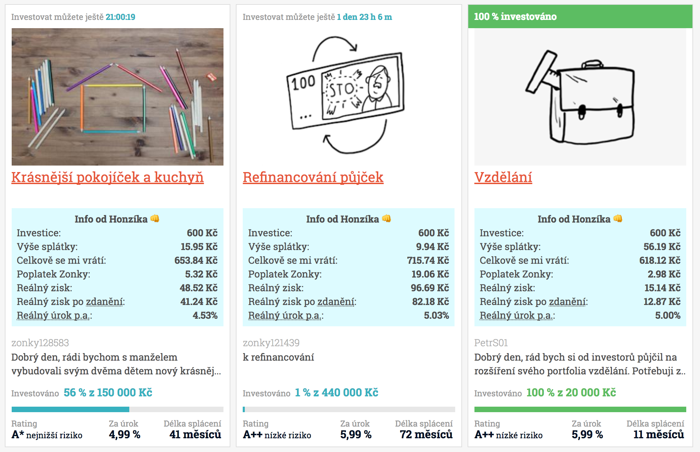

# Zonky Investor Info

Zonky Investor Info je plugin pro Google Chrome, který zobrazuje dodatečné informace k půjčce a pomáhá investorům lépe odhadnout půjčky, do kterých investovat.

## Instalace

1. Stáhněte si tento repozitář jako [ZIP soubor](https://github.com/JanPetr/zonky-investor-info/archive/master.zip)
2. Rozbalte ZIP soubor
3. Ve vašem Google Chromě běžte na adresu [chrome://extensions/](chrome://extensions/)
4. Pokud nemáte, tak zathrnětě políčko "Develop mode"
5. Po zathnutí se objeví tlačítko pro nahrání "rozbaleného" rozšíření
6. Vyberte složku s rozbaleným Zonky Investor Info plugin a vyberte
7. Rozšíření je nahráno, není otevřete [Zonky Tržiště](https://app.zonky.cz/) a u všech půjček byste měli vidět dodatečné informace

## Přispění k vývoji

Pokud najdete jakoukoli chybku nebo budete chtít rozšiřit funkčnost pluginu, neváhejte a vytvořte [nové Issue](https://github.com/JanPetr/zonky-investor-info/issues/new) nebo, pokud jste developer, pošlete rovnou [Pull Request](https://github.com/JanPetr/zonky-investor-info/compare).

## Poděkování

Dík patří Petru "Pixymu" Staníčkovi, jehož web [Výpočet úroků, splátek a úspor](http://www.pixy.cz/apps/uroky/) mi byl velkou inspirací pro výpočty.
